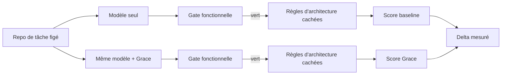

# CodeConform-Bench (CCB)

> Un benchmark exécutable de conformité architecturale du code généré par IA.

[English](README.md) · [Français](README.fr.md)

## Vue d’ensemble

CodeConform-Bench (CCB) mesure si des agents de développement IA produisent du code qui respecte une architecture logicielle cible.

Pour chaque tâche, CCB exécute deux fois le même modèle, dans des conditions identiques :

- **Baseline** — le modèle travaille sans Grace.
- **Grace** — le même modèle travaille avec Grace.

Le code produit est évalué par des règles d’architecture exécutables et invisibles au modèle. Une gate fonctionnelle s’exécute d’abord : un code qui ne compile pas ou casse la suite de tests fonctionnels existants est déclaré en échec fonctionnel et ne reçoit pas de score d’architecture.

CCB rend l’effet d’un guidage architectural mesurable, reproductible et réfutable.

## Ce que CCB mesure

CCB publie :

- **Conformité architecturale** — la proportion de règles d’architecture exécutables qui passent, en score brut et pondéré par criticité.
- **Taux d’échec fonctionnel** — les runs qui ne compilent pas ou cassent les tests fonctionnels existants.
- **Delta Grace** — l’écart entre les scores Grace et baseline, pour un même modèle, langage et scénario.
- **Efficience** — tokens, coût, latence et gain de qualité pour 1 000 tokens supplémentaires.
- **Régularité** — la distribution des scores sur plusieurs runs, pas une tentative isolée.

CCB ne prétend pas mesurer toute la qualité du code. Lisibilité, pertinence métier, sécurité et qualité des tests demandent des évaluations complémentaires.

## Protocole

Le protocole est figé et publié avant les runs :

1. Un repo de tâche est provisionné depuis une révision de template épinglée.
2. Les deux conditions reçoivent la même tâche, les mêmes outils, le même budget de tokens et le même budget d’étapes.
3. Le modèle reçoit l’intention architecturale, jamais les assertions exécutables.
4. Chaque condition est répétée au moins cinq fois.
5. L’évaluateur s’exécute hors du workspace de l’agent ; ses règles ne sont pas accessibles au modèle.
6. Les résultats publient médianes, intervalles de confiance, données brutes de chaque run et versions exactes des modèles.

## Règles d’architecture

Chaque adaptateur de langage exprime la même sémantique architecturale avec son outillage natif. Les catégories initiales sont :

- direction autorisée des dépendances entre couches ;
- cycles de dépendances interdits ;
- placement et conventions de nommage des rôles architecturaux ;
- accès à l’infrastructure interdit hors des frontières d’infrastructure ;
- score pondéré selon les violations bloquantes, majeures ou mineures.

La matrice prévue couvre Java/Kotlin, C#/.NET, TypeScript, Python et Go.

## Reproductibilité et anti-contamination

CCB traite l’isolation de l’évaluation comme une propriété fondamentale :

- les règles d’architecture sont exécutées depuis un dépôt privé distinct ou un artefact CI ;
- le workspace de l’agent contient le code et les tests fonctionnels, jamais la suite d’évaluation ;
- les noms des jobs et fichiers d’évaluation sont neutres ;
- les traces d’exécution sont conservées pour vérifier que les règles cachées n’ont pas été lues ;
- chaque release du benchmark épingle les templates, prompts, identifiants de modèles, version du harness et règles d’évaluation.

## État du projet

CCB définit et valide actuellement son premier protocole public. Le dépôt publiera progressivement le harness exécutable, les adaptateurs de langage, les templates de tâches, la spécification de score et les résultats agrégés.

## Contribuer

Les contributions sont bienvenues, en particulier pour :

- les adaptateurs de règles d’architecture natifs aux langages supportés ;
- les tests de mutation prouvant qu’une règle détecte des violations connues ;
- les solutions de référence validant le pouvoir discriminant du score ;
- les templates de tâches et améliorations de reproductibilité ;
- la revue du protocole et l’analyse statistique.

Ouvre une issue avant de proposer une évolution substantielle du protocole ou du score. La comparabilité du benchmark repose sur des règles versionnées et revues.

## Nom

**CCB** signifie **CodeConform-Bench**.

