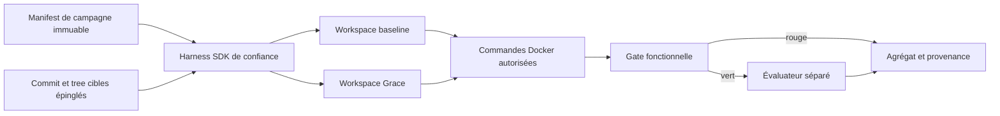
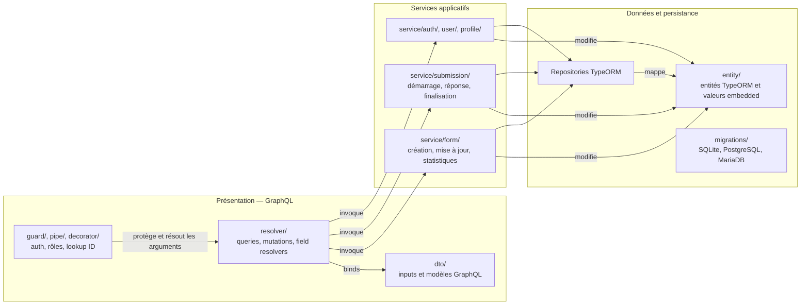
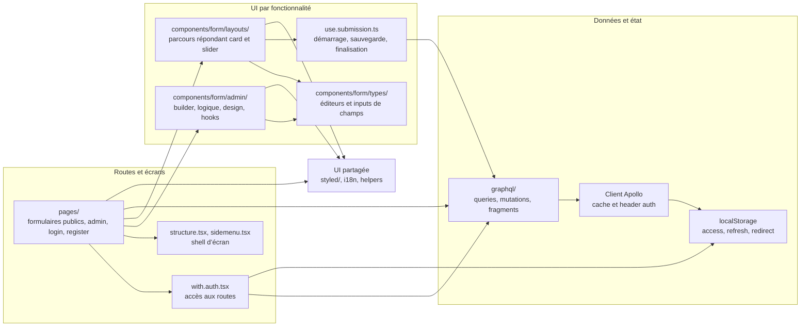

# CodeConform-Bench (CCB)

> Un benchmark exécutable de conformité architecturale du code généré par IA.

[English](README.md) · [Français](README.fr.md)

## Vue d’ensemble

CodeConform-Bench (CCB) mesure si des agents de développement IA produisent du code qui respecte une architecture logicielle cible.

Pour chaque tâche, CCB exécute deux fois le même modèle, dans des conditions identiques :

- **Baseline** — le modèle travaille sans Grace.
- **Grace** — le même modèle travaille avec Grace.

Le code produit est évalué par des règles d’architecture exécutables isolées du modèle. Une gate de caractérisation immuable, extérieure au checkout candidat, s’exécute d’abord : un code qui casse le contrat fonctionnel épinglé est déclaré en échec fonctionnel et ne reçoit pas de score d’architecture.

CCB rend l’effet d’un guidage architectural mesurable, reproductible et réfutable.

## Ce que CCB mesure

CCB publie :

- **Conformité architecturale** — la proportion de règles d’architecture exécutables qui passent, en score brut et pondéré par criticité.
- **Taux d’échec fonctionnel** — les runs qui ne compilent pas ou cassent les tests fonctionnels existants.
- **Delta Grace** — l’écart entre les scores Grace et baseline, pour un même modèle, langage et scénario.
- **Efficience** — tokens, coût, latence et gain de qualité pour 1 000 tokens supplémentaires.
- **Régularité** — la distribution des scores sur plusieurs runs, pas une tentative isolée.

CCB ne prétend pas mesurer toute la qualité du code. Lisibilité, pertinence métier, sécurité et qualité des tests demandent des évaluations complémentaires.

## Protocole


Le protocole est figé et publié avant les runs :

1. Un repo de tâche est provisionné depuis une révision de template épinglée.
2. Les deux conditions reçoivent la même tâche, les mêmes outils, le même budget de tokens et le même budget d’étapes.
3. Le modèle reçoit l’intention architecturale, jamais les assertions exécutables.
4. Chaque condition est répétée au moins cinq fois.
5. L’évaluateur s’exécute hors du workspace de l’agent ; ses règles ne sont pas accessibles au modèle.
6. Les résultats publient médianes, intervalles de confiance, données brutes de chaque run et versions exactes des modèles.

## Architecture implémentée du benchmark

Le harness Node de confiance appelle directement OpenRouter et expose quatre outils : lister, lire et écrire dans le candidat, puis lancer une commande de validation nommée. Les commandes s’exécutent sur un montage candidat en lecture seule dans Docker, sans réseau, credentials, socket Docker ni montage de l’évaluateur. Le probe fonctionnel final n’est monté qu’après la fin de l’agent ; ses assertions restent dans le processus hôte. L’évaluateur n’est introduit qu’après la réussite de cette gate.



L’ordre baseline/Grace alterne entre les paires. Le delta Grace utilise uniquement les paires complètes et scorées ; les échecs fonctionnels ou d’évaluation restent des statuts séparés, jamais des zéros imputés.

## Matrice initiale des modèles

CCB compare des niveaux de gamme, et non des équivalences de qualité présumées. Chaque campagne épingle l’identifiant du modèle et consigne sa configuration fournisseur.

| Niveau | Anthropic | OpenAI | Google | Mistral |
| --- | --- | --- | --- | --- |
| Rapide et économique | `anthropic/claude-haiku-4.5` | `openai/gpt-5.6-luna` | `google/gemini-3.1-flash-lite` | `mistralai/mistral-small-2603` |
| Agent de code équilibré | `anthropic/claude-sonnet-5` — élevé | `openai/gpt-5.6-terra` — élevé | `google/gemini-3.7-flash` — élevé | `mistralai/mistral-medium-3-5` — élevé |
| Raisonnement autonome premium | `anthropic/claude-fable-5` — élevé | `openai/gpt-5.6-sol` — élevé | `google/gemini-3.1-pro-preview` — élevé | — |

Gemini 3.1 Pro Preview est inclus volontairement dans le niveau premium. Chaque résultat qui l’utilise doit l’identifier comme une preview et consigner l’identifiant exact du modèle ainsi que la date du run. Aucun modèle Codestral ou Devstral n’est inclus : les spécialistes du code ne sont pas des équivalents de niveau de gamme. Mistral Medium 3.5 doit exécuter son niveau de raisonnement élevé, consigné pour chaque run. Le niveau rapide et économique consigne la configuration de raisonnement disponible chez chaque fournisseur, sans supposer que tous les modèles supportent le niveau élevé.

Sources : [Claude Haiku 4.5](https://openrouter.ai/anthropic/claude-haiku-4.5), [Claude Sonnet 5](https://openrouter.ai/anthropic/claude-sonnet-5), [Claude Fable 5](https://openrouter.ai/anthropic/claude-fable-5), [GPT-5.6 Luna](https://openrouter.ai/openai/gpt-5.6-luna), [GPT-5.6 Terra](https://openrouter.ai/openai/gpt-5.6-terra), [GPT-5.6 Sol](https://openrouter.ai/openai/gpt-5.6-sol), [Gemini 3.1 Flash Lite](https://openrouter.ai/google/gemini-3.1-flash-lite), [Gemini 3.1 Pro Preview](https://openrouter.ai/google/gemini-3.1-pro-preview), [Gemini 3.7 Flash](https://openrouter.ai/google/gemini-3.7-flash), [Mistral Small 4](https://openrouter.ai/mistralai/mistral-small-2603), [Mistral Medium 3.5](https://openrouter.ai/mistralai/mistral-medium-3-5) et [configuration de raisonnement OpenRouter](https://openrouter.ai/docs/guides/best-practices/reasoning-tokens).

## Règles d’architecture

Chaque adaptateur de langage exprime la même sémantique architecturale avec son outillage natif. Les catégories initiales sont :

- direction autorisée des dépendances entre couches ;
- cycles de dépendances interdits ;
- placement et conventions de nommage des rôles architecturaux ;
- accès à l’infrastructure interdit hors des frontières d’infrastructure ;
- score pondéré selon les violations bloquantes, majeures ou mineures.

La matrice prévue couvre Java/Kotlin, C#/.NET, TypeScript, Python et Go.

## Reproductibilité et anti-contamination

CCB traite l’isolation de l’évaluation comme une propriété fondamentale :

- l’évaluateur et le rule pack versionné restent hors du checkout candidat ;
- le modèle ne reçoit ni shell, ni outil web/search/fetch, ni chemin d’évaluateur, ni credential ;
- les commandes candidat s’exécutent dans Docker avec `--network none`, un workspace et des dépendances vérifiées par digest en lecture seule, des ressources bornées, un seul appel de validation et aucun socket Docker ;
- commit/tree cible et digest de l’export matérialisé, digest du contexte Grace, digests des montages de dépendances/probe, image du conteneur, runner d’évaluation, rule pack, politique fournisseur, prompts, artefacts candidats et traces sont épinglés ou hashés ;
- l’évaluateur ne renvoie que le statut, les compteurs et les scores agrégés ; aucun diagnostic détaillé n’est envoyé au modèle.

Le benchmark vérifie un comportement observable, pas la résistance à un programme volontairement conscient du test. L’agent ne reçoit jamais le probe final ni ses assertions ; un code qui détecte intentionnellement l’environnement de validation pour le traiter à part sort du modèle de menace expérimental.

## État et vérification

La première tranche exécutable est `campaigns/ohmyform-v1.json` : cinq paires sur la tâche OhMyForm submission-start épinglée. Le harness public, le parseur strict de manifest, la boucle d’outils OpenRouter, l’exécuteur Docker, la gate fonctionnelle, l’adaptateur d’évaluation, l’agrégation appariée et les preuves de provenance sont implémentés.

```sh
npm ci --ignore-scripts
npm test
```

Les campagnes payantes s’exécutent via `.github/workflows/benchmarks.yml` avec le secret de repository `OPENROUTER_API_KEY`. Les contrôles du harness et chaque benchmark apparaissent comme des jobs séparés dans le graphe GitHub Actions. Chaque benchmark publie sa consommation de tokens, son coût OpenRouter, ses résultats appariés et ses erreurs dans le Job Summary, puis attache `report.md`, `aggregate.json` et les preuves de provenance dans un artifact conservé 30 jours. Les workspaces candidats et les traces modèle brutes ne sont jamais publiés. Le guide `docs/ia/benchmark-bootstrap/user-guide.md` donne la procédure exacte.

### Première cible de benchmark

Le checkout OhMyForm audité et la campagne sont épinglés dans `campaigns/ohmyform-v1.json`.

#### Architecture actuelle et état d’OhMyForm

Le checkout audité (`c099827`) est organisé en trois tiers techniques côté backend, et non en clean/hexagonal architecture. Les schémas ci-dessous décrivent les dépendances de code, pas la topologie de déploiement.

##### Backend — architecture de code actuelle en trois tiers



##### Frontend — architecture de code actuelle



##### Écarts constatés avec une clean architecture

**Backend**

- Il n’existe pas de couche domaine indépendante : les classes de `entity/` sont des modèles de persistance TypeORM, avec chargement des relations et cascades (`api/src/entity/form.entity.ts`).
- Les services applicatifs dépendent directement des inputs GraphQL, des entités TypeORM et de `Repository<T>`, au lieu de commandes applicatives et de ports de repository possédés par l’application (`api/src/service/form/form.update.service.ts`).
- Les resolvers GraphQL mélangent transport, autorisation, décodage des IDs, mise à jour du cache, chargement des données et orchestration de cas d’usage (`api/src/resolver/form/form.update.mutation.ts`).
- La mise à jour d’un formulaire modifie champs, options, règles conditionnelles, hooks, design, notifications et pages dans une seule opération technique. L’agrégat métier n’a pas de frontière d’invariants isolée (`api/src/service/form/form.update.service.ts`).
- Les effets email et webhook passent par des services concrets ; aucun port applicatif n’isole ces intégrations techniques.
- Aucun test applicatif n’a été trouvé dans le checkout audité : il n’existe donc pas de filet de caractérisation pour extraire les couches.

**Frontend**

- Les routes et composants d’écran consomment directement queries, mutations et fragments GraphQL ; la présentation dépend du contrat de transport (`ui/pages/admin/forms/[id]/index.tsx`).
- Il n’existe pas de couche domaine/applicative frontend indépendante d’Apollo et des payloads GraphQL ; les composants d’édition manipulent les fragments GraphQL comme modèle de travail.
- `use.submission.ts` mélange état UI, génération de token côté client, détection du device navigateur, appels de mutations GraphQL et sérialisation des valeurs.
- `with.auth.tsx` mélange politique d’accès, lookup GraphQL de l’utilisateur, stockage navigateur, UI de chargement et redirections de navigation.
- L’état d’authentification a des mécanismes qui se chevauchent : Apollo lit `localStorage`, tandis qu’un slice Redux `store/auth/` non utilisé reste dans le code.
- Le renderer de formulaire, les éditeurs de champs et l’éditeur de logique conditionnelle répartissent les préoccupations de feature entre routes, hooks et composants, plutôt que de les composer via une frontière applicative stable.

Le produit couvre l’authentification et l’administration, l’édition et la publication de formulaires, onze types de champs déclarés par l’API, la logique conditionnelle, les soumissions progressives, deux layouts répondant, l’internationalisation, les statistiques, les exports, les emails et les webhooks. Les principaux risques de refacto backend sont le gros agrégat `Form` couplé à TypeORM, un flux unique de mise à jour qui réécrit champs/options/logique/hooks/design/notifications/pages, trois dialectes SGBD et l’absence de suite de tests applicatifs dans le checkout audité.


## Contribuer

Les contributions sont bienvenues, en particulier pour :

- les adaptateurs de règles d’architecture natifs aux langages supportés ;
- les tests de mutation prouvant qu’une règle détecte des violations connues ;
- les solutions de référence validant le pouvoir discriminant du score ;
- les templates de tâches et améliorations de reproductibilité ;
- la revue du protocole et l’analyse statistique.

Ouvre une issue avant de proposer une évolution substantielle du protocole ou du score. La comparabilité du benchmark repose sur des règles versionnées et revues.

## Nom

**CCB** signifie **CodeConform-Bench**.

