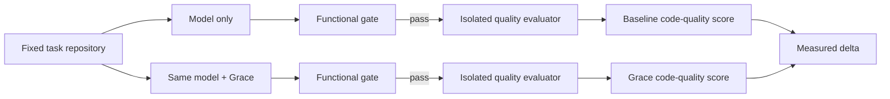
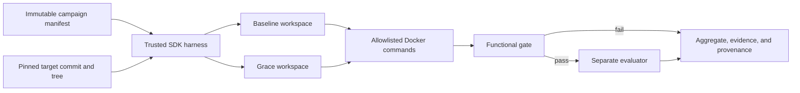
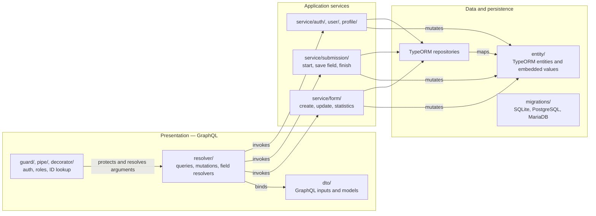
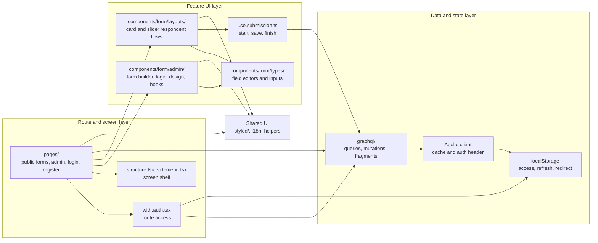

# CodeConform-Bench (CCB)

> An executable benchmark for functional correctness and code quality in AI-generated software.

[English](README.md) · [Français](README.fr.md)

## Overview

CodeConform-Bench (CCB) measures whether AI coding agents produce functional, maintainable code that respects a target software architecture.

For every task, CCB runs the same model under the same conditions twice:

- **Baseline** — the model works without Grace.
- **Grace** — the same model works with Grace.

The benchmark first applies an immutable functional gate outside the candidate checkout. Once a condition has at least one genuinely scored attempt, functional and agent failures contribute zero to its end-to-end code-quality mean. If nothing was scored, quality and confidence data remain unavailable rather than appearing as zero. Functional candidates are then evaluated by isolated, deterministic rules covering architecture, maintainability, clarity, tests, and robustness.

CCB is designed to make model code quality and the effect of Grace measurable, reproducible, and falsifiable.

## What CCB measures

CCB reports:

- **Functional pass@1** — the share of valid first attempts that preserve the pinned behavior.
- **Quality-qualified pass@1** — the share that also clears the versioned overall and per-dimension quality thresholds.
- **Code Quality Score** — the mean end-to-end score across architecture, maintainability, clarity, tests, and robustness; candidate failures count as zero only when the condition includes a genuinely scored attempt.
- **Grace delta** — the paired difference between Grace and baseline for the same model, task, and attempt.
- **Efficiency** — tokens, cost, latency, and quality gain per additional 1,000 tokens, reported separately from capability.
- **Reliability** — candidate failures remain scored outcomes when scoring exists; provider, harness, and evaluator infrastructure failures are excluded and reported with stable phase/reason codes.
- **Raw scoring evidence** — versioned per-check points, thresholds, candidate-relative `file:line` snippets, evaluated-file metrics, dependency paths, and structure used to justify every score; bounded agent/tool counters, functional mismatches, evaluator diagnostics, and sanitized candidate recovery artifacts make non-scored attempts actionable.

The current OhMyForm slice is a single-task case study. Cross-model generalization requires a larger, versioned task suite with equal task weighting.

## Protocol



The protocol is fixed and published before benchmark runs:

1. A task repository is provisioned from a pinned template revision.
2. The same task, tool access, token budget, and step budget are supplied to both conditions.
3. The model receives the functional and code-quality intent, but never the executable assertions.
4. Each condition is repeated three times and aggregated as pass@1 attempts.
5. The evaluator runs separately from the agent workspace; its rules are not available to the model.
6. Results include means, paired confidence intervals only when genuine scores exist, dimension scores, versioned raw per-check evidence, source citations, dependency structure, raw run data, scored-attempt counts, and exact model versions.

## Implemented benchmark architecture

The trusted Node harness calls OpenRouter directly and exposes four tools: candidate-scoped file listing, reading, writing, and one named validation command. Commands run against a read-only candidate mount in Docker without network, credentials, a Docker socket, or evaluator mounts. The final functional probe is mounted only after the agent finishes; its assertions remain in the host process. The evaluator is introduced only after that gate passes.



Baseline/Grace execution order is counterbalanced between pairs. Candidate failures contribute zero only after the same condition has at least one genuinely scored attempt; with no score, quality metrics and confidence intervals are unavailable. Provider, harness, and evaluator infrastructure failures are excluded from applicable denominators and reported explicitly. Grace deltas use every pair with valid measurements on both sides once the campaign has genuine scoring data.

## Initial model matrix

CCB compares model tiers, not claimed quality equivalents. Every campaign pins the model ID and records its provider configuration.

| Tier | Anthropic | OpenAI | Google | Mistral |
| --- | --- | --- | --- | --- |
| Fast, cost-efficient | `anthropic/claude-haiku-4.5` | `openai/gpt-5.6-luna` | `google/gemini-3.1-flash-lite` | `mistralai/mistral-small-2603` |
| Balanced coding agent | `anthropic/claude-sonnet-5` — high | `openai/gpt-5.6-terra` — high | `google/gemini-3.7-flash` — high | `mistralai/mistral-medium-3-5` — high |
| Premium autonomous reasoning | `anthropic/claude-fable-5` — high | `openai/gpt-5.6-sol` — high | `google/gemini-3.1-pro-preview` — high | — |

Gemini 3.1 Pro Preview is intentionally included in the premium tier. Every result using it must identify it as a preview and record the exact model ID and run date. No Codestral or Devstral model is included: code specialists are not tier equivalents. Mistral Medium 3.5 must run with its high reasoning effort recorded. The fast, cost-efficient tier records each provider’s available reasoning configuration rather than assuming that every model supports high effort.

Sources: [Claude Haiku 4.5](https://openrouter.ai/anthropic/claude-haiku-4.5), [Claude Sonnet 5](https://openrouter.ai/anthropic/claude-sonnet-5), [Claude Fable 5](https://openrouter.ai/anthropic/claude-fable-5), [GPT-5.6 Luna](https://openrouter.ai/openai/gpt-5.6-luna), [GPT-5.6 Terra](https://openrouter.ai/openai/gpt-5.6-terra), [GPT-5.6 Sol](https://openrouter.ai/openai/gpt-5.6-sol), [Gemini 3.1 Flash Lite](https://openrouter.ai/google/gemini-3.1-flash-lite), [Gemini 3.1 Pro Preview](https://openrouter.ai/google/gemini-3.1-pro-preview), [Gemini 3.7 Flash](https://openrouter.ai/google/gemini-3.7-flash), [Mistral Small 4](https://openrouter.ai/mistralai/mistral-small-2603), [Mistral Medium 3.5](https://openrouter.ai/mistralai/mistral-medium-3-5), and [OpenRouter reasoning configuration](https://openrouter.ai/docs/guides/best-practices/reasoning-tokens).

## Code-quality rubric

The TypeScript evaluator publishes five normalized dimensions with versioned weights: architecture (30%), maintainability (25%), clarity and type discipline (20%), tests (15%), and robustness (10%). The OhMyForm v2 rule pack uses dependency analysis and TypeScript AST checks for:

- allowed dependency direction, required roles, and forbidden cycles;
- bounded file, function, parameter, and control-flow complexity;
- absence of explicit `any`, diagnostic suppressions, and non-null assertions in the evaluated slice;
- focused success and failure tests without skipped or focused cases;
- absence of empty catches, dynamic code execution, and process-spawning imports.

A candidate is quality-qualified only if its weighted score reaches 70% and every dimension reaches its published minimum. Language adapters may use native tooling, but must preserve the same public dimensions and score contract.

Every scored attempt carries evidence schema v1. A human can recompute each check, dimension, weighted overall score, qualification decision, and violation count from stable check IDs and earned/maximum points. Inline diagnostics are candidate-relative, line-numbered, redacted, and bounded for display. Canonical per-run JSON preserves every evaluated source/test file as complete redacted scored-source content with its original SHA-256 digest, every score-determining dependency path without node truncation, and the complete normalized graph. The full report renders a bounded Mermaid view and points back to that canonical artifact.

Agent execution diagnostics use stable failure codes plus bounded step, request, and tool-name counters; they never publish tool arguments, tool outputs, or model traces. Functional assertion failures retain at most 16 deterministic, sanitized RFC 6901 mismatches. Immediately after every agent return—and before either trusted consumer can touch the workspace—the harness stages a bounded candidate-relative recovery artifact against the pinned target commit/tree. Scored attempts discard it; every non-scored attempt publishes the immutable artifact or an explicit sanitized `recovery_unavailable` reason. Sensitive paths, host paths, credentials, environment data, and model traces are excluded, and redacted or omitted recoveries are labeled sanitized/incomplete rather than exact replays.

Evidence schema v1 accepts five non-empty dimensions and at most 35 unique checks total per run. That budget matches the official TypeScript evaluator and guarantees that all six accepted attempts can show every check row in the bounded Job Summary; over-budget evaluator output fails with a path-bearing `result_schema_invalid` diagnostic before campaign persistence.

The planned language matrix includes Java/Kotlin, C#/.NET, TypeScript, Python, and Go.

## Reproducibility and anti-contamination

CCB treats evaluation isolation as a core property:

- the evaluator and versioned rule pack live outside the candidate checkout;
- the model receives no shell, web/search/fetch tool, evaluator path, or credential;
- candidate commands run in Docker with `--network none`, a read-only workspace and digest-verified dependency mounts, bounded resources, one validation-command call, and no Docker socket;
- target commit/tree and materialized-export digest, Grace MCP endpoint, dependency/probe mount digests, container image, evaluator runner, rule pack, provider policy, prompts, candidate artifacts, and traces are pinned or content-digested;
- the evaluator emits aggregate scores plus complete canonical proof only after the agent finishes; neither the rules nor the evidence are sent back to the model, raw analyzer output with host/environment details is discarded, realistic credentials are redacted, and failures emit the bounded diagnostic/recovery artifacts described above instead of an unsupported score.

The benchmark tests observable behavior, not resistance to a deliberately test-aware program. The agent never receives the final probe or assertions; runtime code that intentionally detects and special-cases the validation environment is outside the experimental threat model.

## Status and verification

The first protocol-v3 slice is `campaigns/ohmyform-v3.json`: three paired pass@1 attempts against the pinned OhMyForm submission-start task, with a 120-step agent budget and explicit observable semantic criteria. Manifest schema v2 and the `ohmyform-v2` rule pack remain unchanged. The public harness, strict manifest parser, OpenRouter tool loop, Docker executor, functional gate, multidimensional evaluator adapter, reconciled scoring-evidence contract, outcome-aware paired aggregation, and provenance records are implemented.

```sh
npm ci --ignore-scripts
npm test
npm run preflight:evaluator -- /absolute/path/to/campaign.json /absolute/path/to/ccb-evaluator/test/fixtures
```

The evaluator preflight is unpaid. CI checks out the exact evaluator commit, verifies the manifest digests, and sends both passing and failing fixtures through the production `ProcessEvaluator` before any benchmark job can read credentials or contact a model provider.

Local coding agents read `.mcp.json` and complete Grace OAuth on their first connection. Paid campaigns run through `.github/workflows/benchmarks.yml`; because GitHub Actions is non-interactive, it uses the repository’s `OPENROUTER_API_KEY` and `GRACE_MCP_TOKEN` secrets instead. A manual dispatch selects either the `small` tier (the default) or the `intermediate` tier; the intermediate matrix runs Claude Sonnet 5, GPT-5.6 Terra, Gemini 3.7 Flash, and Mistral Medium 3.5 without rerunning the small tier. Push-triggered paid runs continue to select the small tier. Only Grace runs connect to the configured Grace SaaS MCP; baseline runs receive neither its instructions nor its tools. Harness checks, the unpaid evaluator preflight, matrix selection, and each benchmark appear as separate jobs in the GitHub Actions graph. Campaigns are fixed at three paired repetitions. Every benchmark publishes a deterministic Job Summary under 128 KiB plus canonical run data, bounded agent/tool and functional diagnostics, evaluator failure diagnostics, and sanitized candidate recovery artifacts; full model traces are excluded from published artifacts.

### First documented benchmark target

CCB will first use `ccb-ohmyform` as its benchmark target. CI/CD will clone this repository to run the benchmarks.

#### Current OhMyForm architecture and state

The audited checkout (`c099827`) uses a technical three-tier backend rather than clean/hexagonal architecture. The diagrams below describe code dependencies, not deployment topology.

##### Backend — current three-tier code architecture



##### Frontend — current code architecture



##### Gaps against clean architecture

**Backend**

- There is no independent domain layer: `entity/` classes are TypeORM persistence models, including relation loading and cascades (`api/src/entity/form.entity.ts`).
- Application services depend directly on GraphQL inputs, TypeORM entities, and `Repository<T>` rather than application-owned commands and repository ports (`api/src/service/form/form.update.service.ts`).
- GraphQL resolvers combine transport concerns with authorization, ID decoding, cache updates, data lookup, and use-case orchestration (`api/src/resolver/form/form.update.mutation.ts`).
- Form updates mutate fields, options, conditional rules, hooks, design, notifications, and pages in one technical operation. The business aggregate has no isolated invariant boundary (`api/src/service/form/form.update.service.ts`).
- Email and webhook effects are invoked from concrete services; no application port isolates those technical integrations.
- No application test suite was found in the audited checkout, so there is no characterization safety net for extracting the layers.

**Frontend**

- Routes and screen components consume GraphQL queries, mutations, and fragments directly; presentation depends on the transport contract (`ui/pages/admin/forms/[id]/index.tsx`).
- There is no frontend domain/application layer independent of Apollo and GraphQL payloads; form-editing components use generated GraphQL fragment shapes as their working model.
- `use.submission.ts` combines UI state, client token generation, browser device detection, GraphQL mutation calls, and value serialization.
- `with.auth.tsx` combines access policy, GraphQL user lookup, browser storage, loading UI, and navigation redirects.
- Authentication state has overlapping mechanisms: Apollo reads `localStorage`, while an unused `store/auth/` Redux slice remains in the codebase.
- The form renderer, field editors, and conditional-logic editor share feature concerns across routes, hooks, and components instead of being composed through a stable application boundary.

The core product covers authentication and administration, form building and publication, eleven API-declared field types, conditional logic, progressive submissions, two respondent layouts, localisation, statistics, exports, emails, and webhooks. The backend’s main refactoring risks are its large `Form` aggregate coupled to TypeORM, a single update flow that rewrites fields/options/logic/hooks/design/notifications/pages, three database dialects, and no application test suite found in the audited checkout.


## Contributing

Contributions are welcome, especially for:

- native architecture-rule adapters for supported languages;
- mutation tests that prove a rule detects known violations;
- gold solutions that validate score discrimination;
- task templates and reproducibility improvements;
- protocol review and statistical analysis.

Please open an issue before proposing a substantial protocol or scoring change. Benchmark comparability depends on versioned, reviewable rules.

## Naming

**CCB** stands for **CodeConform-Bench**.

