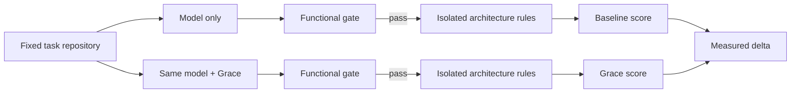
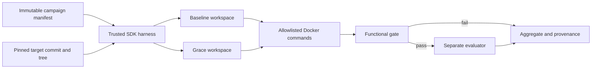
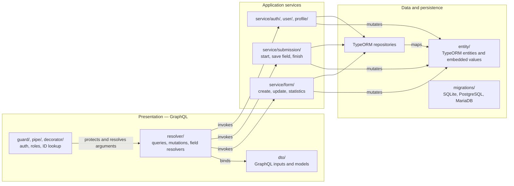
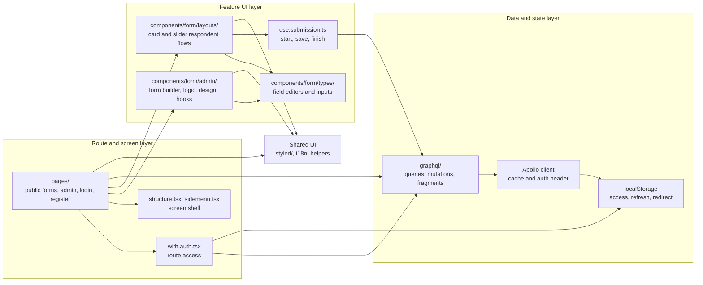

# CodeConform-Bench (CCB)

> An executable benchmark for architectural conformance in AI-generated code.

[English](README.md) · [Français](README.fr.md)

## Overview

CodeConform-Bench (CCB) measures whether AI coding agents produce code that respects a target software architecture.

For every task, CCB runs the same model under the same conditions twice:

- **Baseline** — the model works without Grace.
- **Grace** — the same model works with Grace.

The benchmark evaluates the resulting code with isolated, executable architecture rules. An immutable characterization gate runs first from outside the candidate checkout: code that breaks the pinned functional contract is reported as a functional failure and receives no architectural score.

CCB is designed to make the effect of architectural guidance measurable, reproducible, and falsifiable.

## What CCB measures

CCB reports:

- **Architectural conformance** — the proportion of executable architecture rules that pass, both raw and criticality-weighted.
- **Functional failure rate** — runs that fail to build or break the existing functional tests.
- **Grace delta** — the difference between Grace and baseline scores for the same model, language, and task.
- **Efficiency** — tokens, cost, latency, and quality gain per additional 1,000 tokens.
- **Consistency** — score distribution across repeated runs, not a single lucky attempt.

CCB does **not** claim to measure every aspect of code quality. Readability, domain correctness, security, and test quality require complementary evaluations.

## Protocol



The protocol is fixed and published before benchmark runs:

1. A task repository is provisioned from a pinned template revision.
2. The same task, tool access, token budget, and step budget are supplied to both conditions.
3. The model receives the architectural intent, but never the executable assertions.
4. Each condition is repeated at least five times.
5. The evaluator runs separately from the agent workspace; its rules are not available to the model.
6. Results include medians, confidence intervals, raw run data, and exact model versions.

## Implemented benchmark architecture

The trusted Node harness calls OpenRouter directly and exposes four tools: candidate-scoped file listing, reading, writing, and one named validation command. Commands run against a read-only candidate mount in Docker without network, credentials, a Docker socket, or evaluator mounts. The final functional probe is mounted only after the agent finishes; its assertions remain in the host process. The evaluator is introduced only after that gate passes.



Baseline/Grace execution order is counterbalanced between pairs. The aggregate uses only complete scored pairs for Grace delta; functional and evaluator failures are reported separately rather than imputed as zero.

## Initial model matrix

CCB compares model tiers, not claimed quality equivalents. Every campaign pins the model ID and records its provider configuration.

| Tier | Anthropic | OpenAI | Google | Mistral |
| --- | --- | --- | --- | --- |
| Fast, cost-efficient | `anthropic/claude-haiku-4.5` | `openai/gpt-5.6-luna` | `google/gemini-3.1-flash-lite` | `mistralai/mistral-small-2603` |
| Balanced coding agent | `anthropic/claude-sonnet-5` — high | `openai/gpt-5.6-terra` — high | `google/gemini-3.7-flash` — high | `mistralai/mistral-medium-3-5` — high |
| Premium autonomous reasoning | `anthropic/claude-fable-5` — high | `openai/gpt-5.6-sol` — high | `google/gemini-3.1-pro-preview` — high | — |

Gemini 3.1 Pro Preview is intentionally included in the premium tier. Every result using it must identify it as a preview and record the exact model ID and run date. No Codestral or Devstral model is included: code specialists are not tier equivalents. Mistral Medium 3.5 must run with its high reasoning effort recorded. The fast, cost-efficient tier records each provider’s available reasoning configuration rather than assuming that every model supports high effort.

Sources: [Claude Haiku 4.5](https://openrouter.ai/anthropic/claude-haiku-4.5), [Claude Sonnet 5](https://openrouter.ai/anthropic/claude-sonnet-5), [Claude Fable 5](https://openrouter.ai/anthropic/claude-fable-5), [GPT-5.6 Luna](https://openrouter.ai/openai/gpt-5.6-luna), [GPT-5.6 Terra](https://openrouter.ai/openai/gpt-5.6-terra), [GPT-5.6 Sol](https://openrouter.ai/openai/gpt-5.6-sol), [Gemini 3.1 Flash Lite](https://openrouter.ai/google/gemini-3.1-flash-lite), [Gemini 3.1 Pro Preview](https://openrouter.ai/google/gemini-3.1-pro-preview), [Gemini 3.7 Flash](https://openrouter.ai/google/gemini-3.7-flash), [Mistral Small 4](https://openrouter.ai/mistralai/mistral-small-2603), [Mistral Medium 3.5](https://openrouter.ai/mistralai/mistral-medium-3-5), and [OpenRouter reasoning configuration](https://openrouter.ai/docs/guides/best-practices/reasoning-tokens).

## Architecture rules

Each language adapter expresses the same architectural semantics through its native tooling. The initial rule categories are:

- allowed dependency direction between layers;
- forbidden dependency cycles;
- placement and naming conventions for architectural roles;
- forbidden infrastructure access outside infrastructure boundaries;
- severity-weighted scoring for blocking, major, and minor violations.

The planned language matrix includes Java/Kotlin, C#/.NET, TypeScript, Python, and Go.

## Reproducibility and anti-contamination

CCB treats evaluation isolation as a core property:

- the evaluator and versioned rule pack live outside the candidate checkout;
- the model receives no shell, web/search/fetch tool, evaluator path, or credential;
- candidate commands run in Docker with `--network none`, a read-only workspace and digest-verified dependency mounts, bounded resources, one validation-command call, and no Docker socket;
- target commit/tree and materialized-export digest, Grace-context digest, dependency/probe mount digests, container image, evaluator runner, rule pack, provider policy, prompts, candidate artifacts, and traces are pinned or content-digested;
- the evaluator returns only aggregate status, counts, and scores; detailed diagnostics are not sent to the model.

The benchmark tests observable behavior, not resistance to a deliberately test-aware program. The agent never receives the final probe or assertions; runtime code that intentionally detects and special-cases the validation environment is outside the experimental threat model.

## Status and verification

The first runnable slice is `campaigns/ohmyform-v1.json`: five paired runs against the pinned OhMyForm submission-start task. The public harness, strict manifest parser, OpenRouter tool loop, Docker executor, functional gating, evaluator adapter, paired aggregation, and provenance records are implemented.

```sh
npm ci --ignore-scripts
npm test
```

The paid campaigns run through `.github/workflows/benchmarks.yml`, using the repository’s `OPENROUTER_API_KEY` secret. Harness checks and each benchmark appear as separate jobs in the GitHub Actions graph. Every benchmark publishes token usage, OpenRouter cost, paired results, and failures in its Job Summary, and attaches `report.md`, `aggregate.json`, and provenance records as a 30-day artifact. Candidate workspaces and raw model traces are never uploaded. See `docs/ia/benchmark-bootstrap/user-guide.md` for the exact retest sequence.

### First documented benchmark target

CCB will first use `ccb-ohmyform` as its benchmark target. CI/CD will clone this repository to run the benchmarks.

#### Current OhMyForm architecture and state

The audited checkout (`c099827`) uses a technical three-tier backend rather than clean/hexagonal architecture. The diagrams below describe code dependencies, not deployment topology.

##### Backend — current three-tier code architecture



##### Frontend — current code architecture



##### Gaps against clean architecture

**Backend**

- There is no independent domain layer: `entity/` classes are TypeORM persistence models, including relation loading and cascades (`api/src/entity/form.entity.ts`).
- Application services depend directly on GraphQL inputs, TypeORM entities, and `Repository<T>` rather than application-owned commands and repository ports (`api/src/service/form/form.update.service.ts`).
- GraphQL resolvers combine transport concerns with authorization, ID decoding, cache updates, data lookup, and use-case orchestration (`api/src/resolver/form/form.update.mutation.ts`).
- Form updates mutate fields, options, conditional rules, hooks, design, notifications, and pages in one technical operation. The business aggregate has no isolated invariant boundary (`api/src/service/form/form.update.service.ts`).
- Email and webhook effects are invoked from concrete services; no application port isolates those technical integrations.
- No application test suite was found in the audited checkout, so there is no characterization safety net for extracting the layers.

**Frontend**

- Routes and screen components consume GraphQL queries, mutations, and fragments directly; presentation depends on the transport contract (`ui/pages/admin/forms/[id]/index.tsx`).
- There is no frontend domain/application layer independent of Apollo and GraphQL payloads; form-editing components use generated GraphQL fragment shapes as their working model.
- `use.submission.ts` combines UI state, client token generation, browser device detection, GraphQL mutation calls, and value serialization.
- `with.auth.tsx` combines access policy, GraphQL user lookup, browser storage, loading UI, and navigation redirects.
- Authentication state has overlapping mechanisms: Apollo reads `localStorage`, while an unused `store/auth/` Redux slice remains in the codebase.
- The form renderer, field editors, and conditional-logic editor share feature concerns across routes, hooks, and components instead of being composed through a stable application boundary.

The core product covers authentication and administration, form building and publication, eleven API-declared field types, conditional logic, progressive submissions, two respondent layouts, localisation, statistics, exports, emails, and webhooks. The backend’s main refactoring risks are its large `Form` aggregate coupled to TypeORM, a single update flow that rewrites fields/options/logic/hooks/design/notifications/pages, three database dialects, and no application test suite found in the audited checkout.


## Contributing

Contributions are welcome, especially for:

- native architecture-rule adapters for supported languages;
- mutation tests that prove a rule detects known violations;
- gold solutions that validate score discrimination;
- task templates and reproducibility improvements;
- protocol review and statistical analysis.

Please open an issue before proposing a substantial protocol or scoring change. Benchmark comparability depends on versioned, reviewable rules.

## Naming

**CCB** stands for **CodeConform-Bench**.

