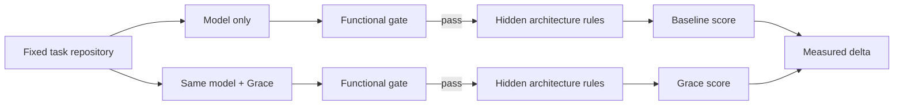
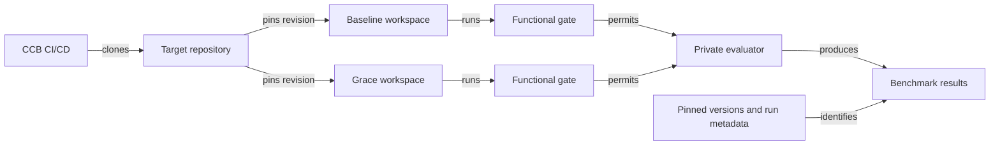

# CodeConform-Bench (CCB)

> An executable benchmark for architectural conformance in AI-generated code.

[English](README.md) · [Français](README.fr.md)

## Overview

CodeConform-Bench (CCB) measures whether AI coding agents produce code that respects a target software architecture.

For every task, CCB runs the same model under the same conditions twice:

- **Baseline** — the model works without Grace.
- **Grace** — the same model works with Grace.

The benchmark evaluates the resulting code with hidden, executable architecture rules. A functional gate runs first: code that does not build or breaks the existing functional test suite is reported as a functional failure and receives no architectural score.

CCB is designed to make the effect of architectural guidance measurable, reproducible, and falsifiable.

## What CCB measures

CCB reports:

- **Architectural conformance** — the proportion of executable architecture rules that pass, both raw and criticality-weighted.
- **Functional failure rate** — runs that fail to build or break the existing functional tests.
- **Grace delta** — the difference between Grace and baseline scores for the same model, language, and task.
- **Efficiency** — tokens, cost, latency, and quality gain per additional 1,000 tokens.
- **Consistency** — score distribution across repeated runs, not a single lucky attempt.

CCB does **not** claim to measure every aspect of code quality. Readability, domain correctness, security, and test quality require complementary evaluations.

## Protocol

The protocol is fixed and published before benchmark runs:

1. A task repository is provisioned from a pinned template revision.
2. The same task, tool access, token budget, and step budget are supplied to both conditions.
3. The model receives the architectural intent, but never the executable assertions.
4. Each condition is repeated at least five times.
5. The evaluator runs separately from the agent workspace; its rules are not available to the model.
6. Results include medians, confidence intervals, raw run data, and exact model versions.

## Proposed benchmark architecture

The proposed architecture keeps agent workspaces separate from the private evaluator. A target repository pinned by CI/CD supplies identical baseline and Grace runs. Only runs that pass the functional gate receive an architecture score.

Text equivalent: CI/CD clones a pinned target repository for baseline and Grace. Each run must pass the functional gate before the separate private evaluator produces architecture results, identified with the pinned versions and run metadata.

## Initial model matrix

CCB compares model tiers, not claimed quality equivalents. Every campaign pins the model ID and records its provider configuration.

| Tier | Anthropic | OpenAI | Google | Mistral |
| --- | --- | --- | --- | --- |
| Fast, cost-efficient | `anthropic/claude-haiku-4.5` | `openai/gpt-5.6-luna` | `google/gemini-3.1-flash-lite` | `mistralai/mistral-small-2603` |
| Balanced coding agent | `anthropic/claude-sonnet-5` — high | `openai/gpt-5.6-terra` — high | `google/gemini-3.7-flash` — high | `mistralai/mistral-medium-3-5` — high |
| Premium autonomous reasoning | `anthropic/claude-fable-5` — high | `openai/gpt-5.6-sol` — high | `google/gemini-3.1-pro-preview` — high | — |

Gemini 3.1 Pro Preview is intentionally included in the premium tier. Every result using it must identify it as a preview and record the exact model ID and run date. No Codestral or Devstral model is included: code specialists are not tier equivalents. Mistral Medium 3.5 must run with its high reasoning effort recorded. The fast, cost-efficient tier records each provider’s available reasoning configuration rather than assuming that every model supports high effort.

Sources: [Claude Haiku 4.5](https://openrouter.ai/anthropic/claude-haiku-4.5), [Claude Sonnet 5](https://openrouter.ai/anthropic/claude-sonnet-5), [Claude Fable 5](https://openrouter.ai/anthropic/claude-fable-5), [GPT-5.6 Luna](https://openrouter.ai/openai/gpt-5.6-luna), [GPT-5.6 Terra](https://openrouter.ai/openai/gpt-5.6-terra), [GPT-5.6 Sol](https://openrouter.ai/openai/gpt-5.6-sol), [Gemini 3.1 Flash Lite](https://openrouter.ai/google/gemini-3.1-flash-lite), [Gemini 3.1 Pro Preview](https://openrouter.ai/google/gemini-3.1-pro-preview), [Gemini 3.7 Flash](https://openrouter.ai/google/gemini-3.7-flash), [Mistral Small 4](https://openrouter.ai/mistralai/mistral-small-2603), [Mistral Medium 3.5](https://openrouter.ai/mistralai/mistral-medium-3-5), and [OpenRouter reasoning configuration](https://openrouter.ai/docs/guides/best-practices/reasoning-tokens).

## Architecture rules

Each language adapter expresses the same architectural semantics through its native tooling. The initial rule categories are:

- allowed dependency direction between layers;
- forbidden dependency cycles;
- placement and naming conventions for architectural roles;
- forbidden infrastructure access outside infrastructure boundaries;
- severity-weighted scoring for blocking, major, and minor violations.

The planned language matrix includes Java/Kotlin, C#/.NET, TypeScript, Python, and Go.

## Reproducibility and anti-contamination

CCB treats evaluation isolation as a core property:

- architecture rules run from a separate private evaluation repository or CI artifact;
- the agent workspace contains code and functional tests, not the evaluation suite;
- evaluation job and file names are neutral;
- execution traces are retained to verify that hidden rules were not read;
- every benchmark release pins templates, prompts, model identifiers, harness version, and evaluation rules.

## Status

CCB is currently defining and validating its first public protocol. The repository will publish the runnable harness, language adapters, task templates, scoring specification, and aggregated results as they become available.

### First documented benchmark target

CCB will first use `ccb-ohmyform` as its benchmark target. CI/CD will clone this repository to run the benchmarks.

## Contributing

Contributions are welcome, especially for:

- native architecture-rule adapters for supported languages;
- mutation tests that prove a rule detects known violations;
- gold solutions that validate score discrimination;
- task templates and reproducibility improvements;
- protocol review and statistical analysis.

Please open an issue before proposing a substantial protocol or scoring change. Benchmark comparability depends on versioned, reviewable rules.

## Naming

**CCB** stands for **CodeConform-Bench**.

