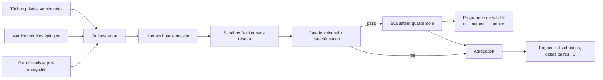

# CCB v5 — Spécification de réécriture

Statut : proposition. Remplace le protocole v4 pour toute nouvelle campagne ; les résultats v3/v4 restent des preuves historiques non poolables.

## 0. Thèse de mesure

Deux questions distinctes, deux axes de rapport jamais poolés :

1. **Axe contrôlé (primaire)** — capacité d'un modèle à produire du code fonctionnel et maintenable *sous un scaffold standardisé identique pour tous*, et effet pairé de Grace sur cette capacité. Instrument : boucle maison (§4).
2. **Axe produit (secondaire)** — performance du système modèle+agent du marché, telle qu'un praticien la vivrait. Instrument : agents réels (Claude Code, Codex CLI, Pi…), rapporté séparément (§9).

Toute affirmation publiée doit se rattacher explicitement à l'un des deux axes. Précédent : Terminal-Bench sépare Terminus (scaffold neutre) des évaluations d'agents complets pour la même raison.

### 0.1 Deux étages de campagne

Le protocole s'exécute en deux étages étiquetés :

- **Étage A — Itération protocole** : **5 tâches × 3 répétitions**, 2–3 modèles. Objectif : casser le harnais, la gate, l'évaluateur et les fuites de contamination avant de payer cher. Résultats **exploratoires** : ils servent à corriger le protocole, jamais à affirmer un effet Grace.
- **Étage B — Confirmation** : suite complète (§5.4) et puissance pleine (§8.2), précédées de la congélation du plan d'analyse (§8.3). Seul l'étage B alimente les conclusions publiées.

Chaque changement de protocole décidé pendant l'étage A est consigné dans un journal ; le protocole est gelé au passage A→B et l'étage B ne peut être ajusté après coup sur ses propres résultats.


## 1. Objectifs

- Généraliser au-delà du cas OhMyForm : suite privée de tâches stratifiées, calibrées, anti-contaminées.
- Atteindre une puissance statistique suffisante pour des deltas Grace affirmables à l'étage B (n ≥ 10 paires par cellule headline, §8.2) — l'étage A (§0.1) n'y prétend pas.
- Rendre le harnais représentatif du travail réel (recherche dans le code, éditions chirurgicales, boucle de validation rejouable) sans abandonner le contrôle instrumental.
- Prouver la validité du score : discrimination or/hors-la-loi, sensibilité aux mutations, corrélation humaine.
- Conserver intégralement les propriétés reproductibilité/isolation de v4 (digests, évaluateur hors checkout, codes d'échelle stables).

## 2. Non-objectifs

- Mesurer « l'intelligence pure » d'un modèle : tout résultat est conditionnel au scaffold, publié comme tel.
- Comparer des produits agents entre eux sur l'axe contrôlé.
- Résister à un programme délibérément conscient du test (hors modèle de menace, inchangé depuis v4).

## 3. Architecture d'ensemble



Composants réécrits : suite de tâches (§5), harnais (§4), gate (§6), évaluateur + validité (§7), statistiques (§8). Composants conservés à l'identique : orchestration Docker, pinning par digest, artefacts de récupération, schémas de diagnostic (§10).

## 4. Harnais agentique (boucle maison, étendue)

Décision : **on ne remplace pas la boucle par un agent du marché**. On copie sa surface d'outils éprouvée, dont les signatures sont connues des données d'entraînement des modèles.

### 4.1 Surface d'outils

| Outil | Signature | Notes |
| --- | --- | --- |
| `list_files` | `(path)` | inchangé |
| `read_file` | `(path, offset?, limit?)` | ajout offset/limit, plafond 1 Mio/fichier |
| `write_file` | `(path, content)` | inchangé |
| `edit` | `(path, old_string, new_string, replace_all?)` | échec si `old_string` absent ou non unique (sauf `replace_all`) ; sémantique type Claude Code/Pi |
| `grep` | `(pattern, path?, include?)` | regex, sorties bornées (compteur + troncature annoncée) |
| `find_files` | `(glob, path?)` | borné à 5 000 entrées |
| `run_command` | `(name)` | allowlist du manifest, **rejouable** jusqu'à `maxCommandCalls` (défaut 8) |

Sandbox inchangé : chemins relatifs canonisés contre le checkout, écriture restreinte aux zones déclarées, aucun chemin absolu, sortie cumulée plafonnée (`maxToolOutputBytes`, défaut 512 Kio).

### 4.2 Commandes approuvées

Le manifest déclare plusieurs commandes nommées (`typecheck`, `lint`, `test`…), exécutables en boucle — c'est la boucle CI d'un développeur réel. Chaque exécution publie uniquement : identifiant, code de sortie/signal, état timeout, raison sanitisée (inchangé).

### 4.3 Boucle et budgets

- Boucle chat complétions, `toolChoice: 'auto'`, arrêt sur réponse sans tool call — inchangé.
- Budgets enforceés **en cours de route** (conservés) : `maxSteps` (défaut relevé à 200), `maxTotalTokens`, `maxCostUsd`, `maxToolOutputBytes`, plus `wallClockSeconds`.
- Retries : backoff exponentiel + `Retry-After` sur 408/429/5xx, fenêtre 120 s — inchangé.
- Validation stricte de l'usage renvoyé (tokens/coût numériques finis positifs) — inchangé.
- Provider : `providerOrder` + `allowFallbacks: false` + enregistrement du `response.model` servi — inchangé.
- Température/top_p : épinglés dans le manifest quand le fournisseur l'autorise ; sinon déclarés « bruit mesuré » dans le rapport, jamais masqués.

### 4.4 Injection Grace

Mécanisme v4 conservé : outils MCP + instructions système injectés dans la même boucle, collision de noms fatale, erreurs d'input Grace renvoyées à l'outil plutôt que fatales. Ajout : le manifest peut désigner un **sous-ensemble de talents** (ablation de dose, §8.4).

## 5. Suite de tâches

### 5.1 Format

Chaque tâche est un répertoire digéré :

```
tasks/<task-id>/
  task.yaml          # énoncé, langage, strates, commandes approuvées, budgets
  environment/       # image Docker épinglée, mounts de dépendances digérés
  probes/            # gate fonctionnel + suite de caractérisation (cachés au modèle)
  gold/              # ≥ 3 solutions de référence humaines
  mutants/           # config d'injection pour validation règle-pack + kill-rate
  rules/             # rule pack versionné (hors checkout candidat à l'exécution)
```

L'énoncé contient l'intention fonctionnelle et qualitative, jamais les assertions — propriété v4 conservée.

### 5.2 Provenance et contamination

- Dérivation de PR fusionnées réelles (diff retiré, issue + comportement observable comme énoncé) ou construction synthétique sur repos non publics.
- **Canary strings** uniques dans chaque fixture ; **sonde d'appartenance** avant admission : compléter la solution sans contexte ; `pass@1 > 0,3` à la sonde ⇒ tâche rejetée.
- Repos publics autorisés seulement si la sonde passe et que la tâche est reformulée.

### 5.3 Granularité : tranches verticales étroites

Une tâche = une tranche verticale **étroite**, pas le refactoring d'un pan d'application :

- réalisable par un développeur compétent en ≤ 2 h ; périmètre ≤ ~10 fichiers modifiés ;
- un seul contrat comportemental principal, vérifiable par ≤ 6 sondes ;
- l'actuelle tâche OhMyForm (port + use case + adaptateur TypeORM + adaptateur GraphQL + recâblage + migration d'appelant + tests) compte pour **2–3 tâches** distinctes, chacune avec sa gate et son rule pack slice.

Raison : les gros refactorings confondent capacité de planification et d'exécution, saturent les budgets de steps et rendent la calibration instable ; les tranches étroites donnent plus de tâches par euro et un meilleur rapport signal/bruit par dimension de la rubrique.

### 5.4 Stratification et calibration

- Étage A : **5 tâches** couvrant ≥ 3 types (bugfix, tranche de refactoring, feature verte) sur un langage.
- Cible étage B : **20–40 tâches** couvrant langage (TS, Python, Go, Java/Kotlin, C#) × type (bugfix, feature verte, refactoring, migration, écriture de tests) × difficulté.
- Calibration en pilote (2–3 modèles bon marché, 3 répétitions) : ne retenir que les tâches de taux de réussite ∈ [0,2 ; 0,8] — en dehors, elles ne discriminent rien.
- Difficulté et taux publiés par tâche ; pondération égale des tâches dans l'agrégat.

### 5.5 Politique de prompt (attribution à Grace)

- Énoncé = intention fonctionnelle + exigence de qualité générique (« production-quality, type-safe, tested »), **sans prescription d'architecture cible** : ni ports, ni couches, ni patterns nommés. La structure choisie par le modèle fait partie de la mesure ; en condition `grace`, les conventions proviennent des talents servies par le MCP — c'est précisément l'effet testé.
- **Garde-fou d'équité (reachabilité)** : chaque solution `gold/` est rédigée depuis l'énoncé seul, sans accès aux talents, et doit franchir les seuils du rule pack. Si aucune ne les atteint, la tâche ou les seuils sont recalibrés avant admission — sinon le delta mesure une consigne reçue par une seule condition, pas un effet.
- Variante étiquetée dans le manifest : `promptStyle: neutral` (primaire) ou `prescribed` (architecture imposée dans l'énoncé, approche v4). La variante `prescribed` sert d'ablation secondaire pour séparer jugement de conception et fidélité d'exécution ; elle n'est pas construite à l'étage A.

## 6. Gate fonctionnel et caractérisation

- Sonde principale hors checkout, montée après coup, assertions côté hôte — inchangé.
- **Suite de caractérisation** : M sondes couvrant le contrat visé *et* les comportements voisins hors périmètre. Le gate reste binaire (pass/fail) pour la qualification ; les échecs hors périmètre sont comptabilisés séparément comme **taux de régression hors périmètre** — signal aujourd'hui absent.
- Codes d'échelle v4 étendus : `characterization_mismatch` distinct de `assertion_mismatch`, même sanitisations (≤ 16 mismatches RFC 6901 déterministes).

## 7. Évaluateur qualité et programme de validité

### 7.1 Rubrique

Cinq dimensions inchangées (architecture 30 %, maintenabilité 25 %, clarté 20 %, tests 15 %, robustesse 10 %), checks AST/dépendances par langage, qualification à 70 % global + minima dimensionnels, schéma de preuve v1 étendu en v2 (ajouts : résultats de caractérisation, kill-rate mutants).

### 7.2 Validité — prérequis de publication, pas contribution optionnelle

Pour chaque rule pack :

1. **Discrimination or** : chaque solution `gold/` doit scorer ≥ 15 points au-dessus de chaque variante dégradée (violations injectées une par une) ; publier les marges.
2. **Sensibilité aux mutations** : chaque règle doit détecter au moins un mutant connu (mutation testing du rule pack lui-même) ; une règle sans mutant détecté est retirée.
3. **Déterminisme** : même candidat ⇒ même score, haché et vérifié en CI.
4. **Kill-rate des tests candidats** : injection de N mutants dans le slice candidat ; le taux de kill alimente la dimension `tests` (remplace progressivement les checks purement structurels).
5. **Corrélation humaine** : échantillon de diffs notés en aveugle par ≥ 3 experts ; Spearman ρ publié par dimension. Objectif ≥ 0,5 sur le score global avant toute communication publique.

## 8. Conditions expérimentales et statistiques

### 8.1 Pairage

Baseline vs Grace, même modèle/même tâche/même budget, ordre contrebalancé par paire, graine publiée — inchangé.

### 8.2 Répétitions et puissance

- Étage A : **n = 3 répétitions** par condition sur 5 tâches (30 essais pairés par modèle). Puissance volontairement insuffisante pour un delta : cet étage produit des signaux de protocole (taux de passage de gate, causes d'échec, budgets consommés, variance inter-répétitions), pas des conclusions.
- Étage B, cellules headline (modèles premium + balanced) : **n = 12 répétitions** par condition ; extension à 30 en allocation séquentielle : arrêt quand la demi-largeur de l'IC 95 % du delta passe sous 2 points (échelle 100).
- Cellules secondaires (fast tier, axe produit) : n = 5, rapportées avec IC larges assumés.
- Inférence (étage B uniquement) : bootstrap **par grappes sur les tâches** (la tâche est l'unité de généralisation, pas la répétition) + bootstrap intra-tâche pour les IC par tâche.

### 8.3 Pré-enregistrement et multiplicité

Congélation exigée avant l'étage B — pas avant l'étage A, exploratoire et étiqueté comme tel : métrique primaire unique (**delta pairé moyen du score global sur la suite**), secondaires (dimensions, pass@1, efficacité), seuils, plan d'analyse, nombre de répétitions. Contrôle FDR (Benjamini-Hochberg, q = 0,05) sur les secondaires. Tout changement de protocole observé pendant l'étage A figure au journal (§0.1) ; après gel, aucun critère n'est retouché sur la base des résultats B.

### 8.4 Contrôles spécifiques Grace

- **Contrôles négatifs** : ≥ 20 % des tâches conçues pour être sous-optimales si l'on suit les talents à la lettre ; un delta systématiquement positif y compris là-dessus signale une rigidité induite, pas un gain.
- **Ablation de dose** : talents complets vs sous-ensemble désigné dans le manifest ; relie l'effet au mécanisme.

## 9. Axe produit (séparé)

Les 2–3 meilleurs modèles de l'axe contrôlé repassent la suite via des agents du marché réels, versionnés par digest de commit. Rapporté dans une section dédiée (« système modèle+agent »), jamais moyenné ni comparé directement à l'axe contrôlé. Coût optionnel, activable indépendamment.

## 10. Reproductibilité et isolation (conservé de v4)

Digests de contenu pour : commit/tree cible, exports matérialisés, images Docker, mounts de dépendances, sondes, runner évaluateur, rule packs, manifests, harnais lui-même (publié comme artefact versionné du protocole). Sandbox sans réseau/socket, workspace lecture-seule pendant commandes, évaluateur monté après coup, credentials hors portée, artefacts de récupération candidats pour tout essai non scoré, codes d'échelle stables (`contracts.ts` v4 repris tels quels + extensions §6). Changement de harnais ⇒ nouveau numéro de protocole, non-poolabilité explicite.

## 11. Schéma de données

`RunRecord v2` = v4 + : `taskStrata`, `temperaturePinned`, `promptStyle`, `commandCalls[]` (identifiants/résultats sanitisés), `characterization{passed, failed, outOfScopeRegressions}`, `mutantKillRate`, `graceSubset`. `CampaignResult v2` : distributions par tâche (pas seulement moyennes), tailles d'effet pairées avec IC par grappes, comptes d'essais scorés/non-scorés par phase/raison, corrélations humaines et marges de discrimination du rule pack utilisé.

## 12. Plan d'implémentation

| Phase | Contenu | Sortie |
| --- | --- | --- |
| P0 | Format tâche + harnais étendu (outils §4.1, commandes multiples) + suite étage A (5 tranches étroites) | Harnais digéré |
| P1 | Itération protocole : 2–3 modèles × 5 tâches × 2 conditions × 3 répétitions (~60–90 essais) ; corrections harnais/gate/évaluateur ; journal des changements | Protocole stabilisé |
| P2 | Extension de suite : calibration, ors, validation rule packs (§7.2.1–3) ; congélation du plan d'analyse | Suite étage B admise + pré-enregistrement |
| P3 | Campagne cœur étage B (axe contrôlé) | Résultats primaires |
| P4 | Contrôles négatifs + ablation Grace | Interprétation mécaniste |
| P5 | Axe produit + étude corrélation humaine | Rapport complet |

Coût indicatif : étage A ≈ 60–90 essais (négligeable) ; cœur étage B : 6 modèles × 20–40 tâches × 2 conditions × 12 répétitions ≈ 2 880–5 760 essais, borné par l'allocation séquentielle (§8.2).

## 13. Critères d'acceptation

2. Chaque règle de chaque rule pack a un mutant détecté documenté ; chaque tâche a ≥ 3 ors discriminants, atteignables depuis l'énoncé seul (§5.5).
3. Le harnais expose les 7 outils §4.1 avec tests de sémantique `edit`/`grep` (unicité, bornes, échappement de sandbox).
4. Une campagne complète rejouée depuis les digests produit des scores identiques (déterminisme vérifié en CI).
5. Le rapport primaire montre : delta pairé + IC par grappes, distributions par tâche, taux de régression hors périmètre, part d'essais exclus infra/agent.
6. Aucun chiffre public antérieur à la congélation du plan d'analyse correspondant.
7. Tout rapport issu de l'étage A porte la mention « exploratoire » ; aucune affirmation d'effet Grace n'en est dérivée.
